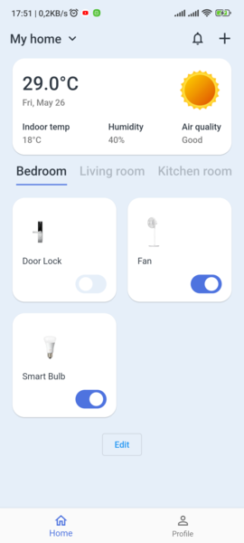
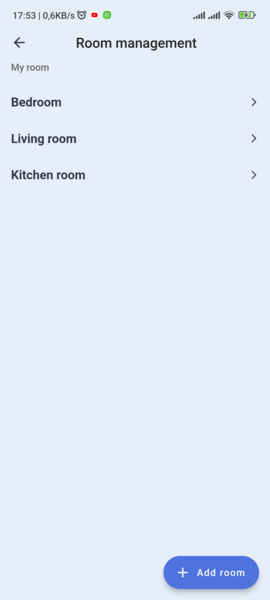
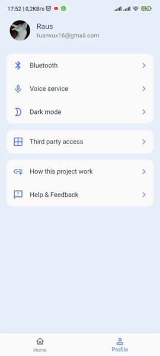
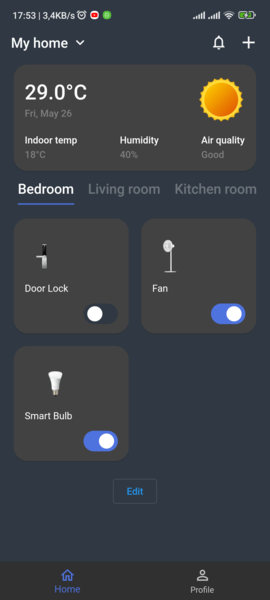
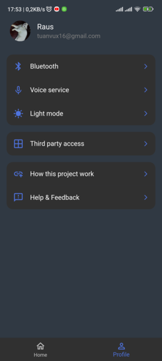
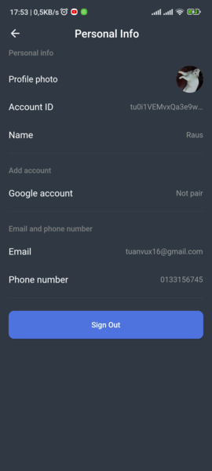

# Smartify
[](LICENSE)

Smarthome app built with Flutter.

This branch, v2.0.0, is used for the IoT project that combines Esp32 and several sensors for the first assignment. For more detailed information, please switch to the main branch.
## App preview










## Installing

- Download [Flutter SDK](https://flutter.dev/docs/get-started/install) to your machine
- Install this repository
- Build and run the debug app on emulator, real device

```bash
    git clone https://github.com/tuanvumaihuynh/flutter-smartify-iot.git
    flutter pub get
    flutter run
```


## License
[MIT](LICENSE)